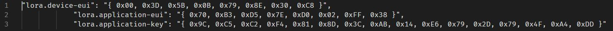

# eui.py 
####  Python script that translates:  ttn device eui and key for mbed-cli [mbed-os-example-lorawan](https://github.com/ARMmbed/mbed-os-example-lorawan) to be used with mbed_app.json

---
###### Background:
[n-PRO-40](https://www.n-blocks.net/nmodules/doku.php?id=nblocks:n-pro-40) Is a LoRaWAN low power sensor node, based on Murata CMWX1ZZABZ LoRa module.  
[mbed-os-example-lorawan](https://github.com/ARMmbed/mbed-os-example-lorawan) is an mbed-cli example, provided by ARM mbed, for a LoRaWAN node working with The Things Network (TTN).
It is a common practice for mbed-cli, all system parameters to be included in the mbed_app.json.

*  lora.device-eui
*  lora.application-eui 
*  lora.application-key 

from TTN console have to be manually translated to json format.  

###### A more automated approach:  

Above process is OK for testing just one LoRaWAN node but is not efficient for programming multiple nodes.  
eui.py automates the eui translation making multiple nodes programing easier.  

---
**mbed_app.json:** device eui and key in mbed_app.json  

---
**Row EUI txt file:** Copy the eui, key to a text file named eui-in.txt

---
**Processed EUI txt file:** After running euy.py a new file eui.out.txt is created. this file content can be copied to mbed_app.json

---
